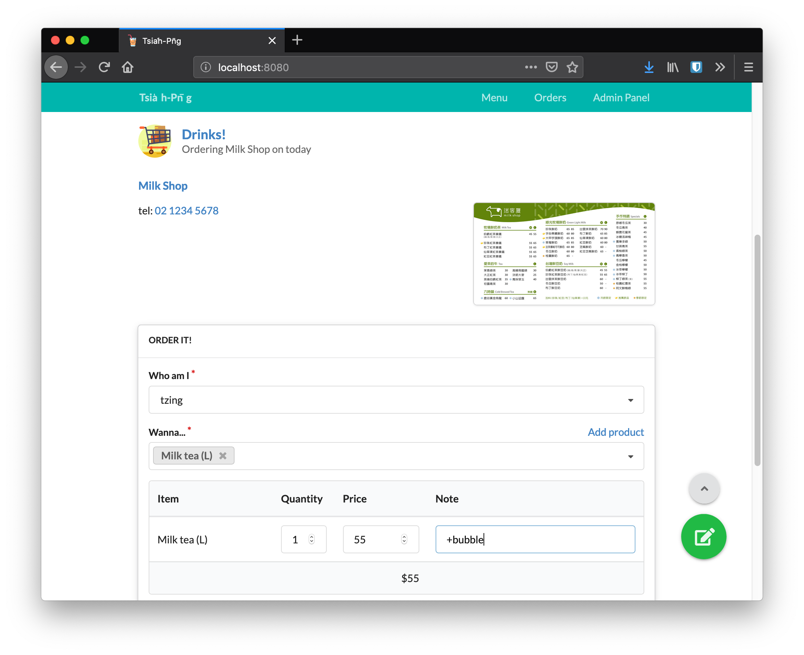

# 呷飯 Tsia̍h-Pn̄g

*呷飯*是一個用來跟朋友一起點餐/團購用的工具，用來簡單地點餐，而不是去面對複雜的購物車、登入及會員系統。
（金流？<s>快跟開團的大大說謝謝請客</s>總有其他方法吧）

*Tsia̍h-Pn̄g* is a group buying tool which could collects orders from your friends (especially meal/drink orders).
Unlike popular shopping cart system, it is designed to be simple and easy to use. There is no cart and login system, one can order a drink or Bento within three steps.
Payment system? No, go to see your friend in real life.

#### Features

+ Easy to order

  No cart, no login system, there is just a simple form.

+ Easy to check

  It provides tables to inspect the total number of items ordered, as well as the quantity and spending from each user.

+ Quick ordering, not only for users

  It could generate text that summarize the orders since some stores receive orders from instant messaging apps.

+ Multiple stores supported

  I don't want to eat the same food everyday.

+ Menu lazy evaluation *(huh?)*

  The author is too lazy to add everything on the menu.
  So there is a button for users to add product into menu when they want to order.

+ Accounting

  <s>What happens in Tsia̍h-Pn̄g, stays in Tsia̍h-Pn̄g.</s>
  It records the spending whenever you need.

## Installation

See [docs/installation](docs/installation.md).

## Credits

Icons made by [Freepik](https://www.freepik.com/) from [www.flaticon.com](https://www.flaticon.com/) is licensed by [CC 3.0 BY](http://creativecommons.org/licenses/by/3.0/).
